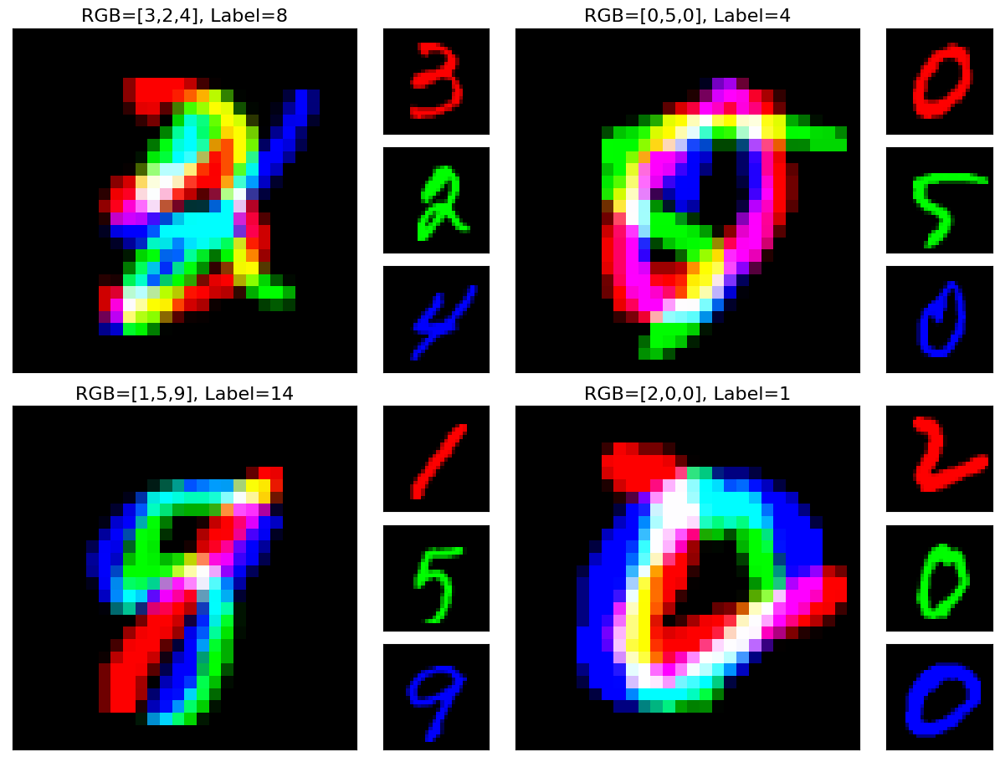

# AddNIST-Image-Classifiers
A collection of three classifiers for classifying images from the AddNIST dataset  

## Data
The dataset used in this project is the AddNIST1 dataset.
Each image is a composition of three MNIST digits one in each of the three colour channels, and the labels for the images are the sum of the three digits contained within the image minus 1. Some examples are given in Figure 1.

### Figure 1: Examples of the AddNIST dataset.

Each image (the large image) is made up of three MNIST images one in each of the three colour channels. The label for the image is the sum of the three numbers and then subtract 1. So, for example the top left image is r=3, g=2, b=4 and the label is r+g+b-1 = 8. There are six datafiles:

| Filename      | A numpy dataframe containing              |
| ------------- | ----------------------------------------- |
| train_x.npy   | 45,000 training example images            |
| train_y.npy   | 45,000 labels for the data in train_x.npy |
| valid_x.npy   | 15,000 more images for validation         |
| valid_y.npy   | 15,000 more labels matching valid_x.npy   |
| test_x.npy    | 10,000 more images for testing            |
| test_y.npy    |  10,000 more labels matching test_x.npy   |

The dataset is constructed in such a way that there are only 20 possible ‘classes’ for the prediction – the numbers 0 through 19. In no scenario should the answers add up to less than zero or more than 19.

## Models
Three separate models are proposed in this repository for use in classification of AddNIST images. Details of each model can be found at the end of their respective Python Notebooks. A short description of each is outlined below.

### Classifier 1
This classifier works by first training the model on MNIST data (from the Keras MNIST dataset). The AddNIST images are then split by colour channel into three separate images (each containing an individual digit). The final value is given by summing the output of three inference runs of the model (each on one of the individual digits) - 1. This is then compared to the labels for the original AddNIST image for evaluation.

### Classifier 2
This classifier works by training the model directly on the training sets of the AddNIST dataset. The model itself is constructed using a pre-built model from Keras' library of models. The model selected is DenseNet201 (https://keras.io/api/applications/densenet/)

### Classifier 3
This classifier works by training the model directly on the training sets of the AddNIST dataset. The model itself is a novel Convolutional Neural Network. A description and evaluation of the model can be found in the short technical report at the end of this file.
